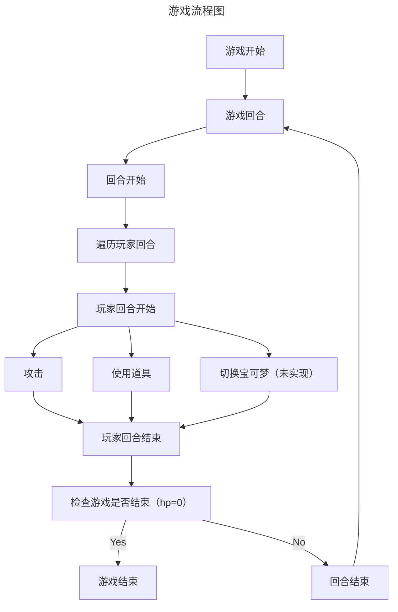

# PokemonGo


## 项目介绍

### 流程图



### 游戏流程介绍

### 目录结构

```bash
weijianxian
│ Basic.py       # 基础类
│ Game.py        # 游戏类
│ main.py        # 入口
│ Player.py      # 玩家类
│ Pokemon.py     # Pokemon类
│ PokemonType.py # Pokemon属性
│ readme.md      # 项目介绍
│ Skills.py      # 技能实现 (WIP)
│ Status.py      # 宝可梦状态实现(WIP)
│
├─utils
│ │ __init__.py  # 重写 print input

```

### 依赖

使用 `pip install colorama` 实现彩色输出
