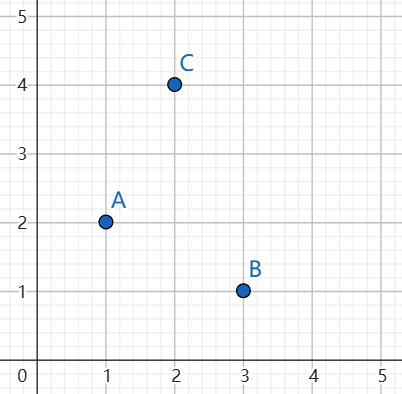
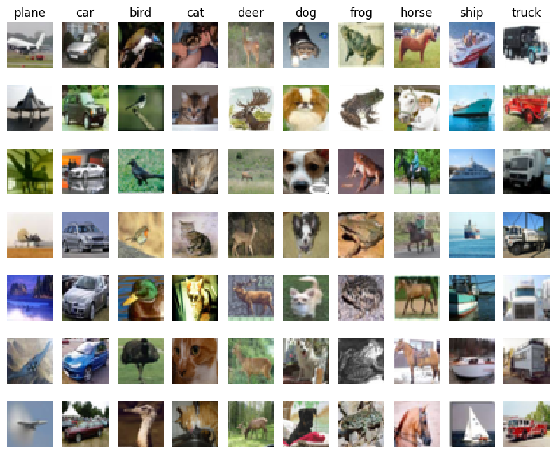

# 笔记 
## lecture 1 

主要讲了对图像进行分类的方法

### 什么是图像分类

我们先从生活中常见的例子开始讲起。

在日常中，我们分类物体时通常会把这个物体和我们记忆中的类别进行匹配，以此来确定它最像什么。

举个例子，我们通常会说一个足球更像圆形而不是方形，这是因为我们把球与圆形，方形进行对比，得出的结论`比起方形来说，它更像圆形`

### 计算机如何进行图像分类

对于计算机视觉来说也是如此，图像分类只不过是把输入的图像和电脑记忆中的图像进行对比，看看它和什么 **更像**。这便是简单的图像分类。

那么问题的关键就是，计算机怎么知道它和哪一类图像更像，也就是这张图和哪类图的距离更近。那么如何计算两个图片之间的距离呢？
#### 计算距离

我们不妨从简单数学开始讲起。

##### 一维

在数学中的一维可以用数轴来表示

假设A放在1cm处 B放在5cm处。现在再引入一个C，放在2cm处。
很明显我们能计算出AC之间的距离是1cm BC之间的距离是4cm。也就是说C距离A更近

##### 二维
推广到二维。
假设坐标平面上有两个点 A(1,2)，B(3,1)。现在我们加入第三个点C(2,4)。我们要判断 点C 距离 A, B哪个点更近



通过图上我们很明显的观察到 `点C 距离 点A 更近`。
但是如果你要问到底是多近，那我们便要量化这个距离。你大可以拿出直尺分别测量得到大致的距离，也可以用两点之间的距离公式
$ r =  \sqrt{(x_A - x_B)^2 + (y_A - y_B)^2} $
来进行计算。

分别带入AC BC的坐标，我们可以很简单的计算出距离

$ r_A =  \sqrt{(x_A - x_C)^2 + (y_A - y_C)^2} = 
         \sqrt{(1 - 2)^2 +(2 - 4)^2} = \sqrt{5} $

$ r_B =  \sqrt{(x_B - x_C)^2 + (y_B - y_C)^2} = 
         \sqrt{(3 - 2)^2 +(1 - 4)^2} = \sqrt{10}$

##### N维
推广到N维，假设两个点
$X(x_1,x_2,x_3,x_4,... x_n)$
$Y(y_1,y_2,y_3,y_4,... y_n)$
我们可以得到这两个点之间的距离公式
$r = \sqrt{(x_1 - y_1)^2 + (x_2 - y_2)^2 ... (x_n - y_n)^2 }$
即

$$
r = \sqrt{\sum_{i=1}^n (x_i - y_i)^2 } 
$$

这样我们就得到了 N维中两个点之间的距离公式

#### 计算机眼里的图片

如果你将一张图无限放大，你可能会看到一些带有颜色的小点，这就是像素点，每个像素点都会有RGB三个值，用于表示颜色。
比如一种2*2的图片，一共有$ 2*2 = 4$ 个像素点，每个像素点都有RGB三个分量，也就是我们可以用 $ 2*2*3=12$ 个数字来表示张图片

那么，你可能会想到既然一张图片可以拆分成N个数字 ，那我们便可以套用上面N维的点的距离计算公式来计算这些图片之间的距离，也就是一张图片更像哪一类。

所有问题都解决了。

### 分类实操

利用python来进行分类，以 cs231n 为例
- [`knn.ipynb`](./knn.ipynb)
- [`cs231n/classifiers/k_nearest_neighbor.py`](./cs231n/classifiers/k_nearest_neighbor.py)

#### 1. 首先我们需要一些已经分好类的数据
这里采用 cifar-10 来作为我们的数据集一部分用来训练，一部分用来测试
这是一些数据集中的图像。

#### 2. 加载数据

##### 1. 训练数据
由于我们的图像是(32,32,3)的，可以把他看成一个长32 宽32 高3的三维数据组。因为这种数据形式不方便进行计算，因此我们可以把每个图像的数据进行拆开，拆成 `一维列表` 即一个长度为$32*32*3 = 3072$的列表

为了便于计算，我们把这些图片组成矩阵，大小为 5000x3027 即有5000行，3072列，每行是一张图片。定义为 `X_train`
我们我们简单表示一下这个图片矩阵
|  | data1 | data2 | data3 | ... | data3027 |
|:---:|:-----:|:-----:|:-----:|:-----:|:-----:|
| 第1行|  55  |   25   |   22  | ... | 11     | 
| 第2行|  55  |   25   |   22  | ... | 11     | 
| ... |  ...  |  ...  |  ...  | ... | ...    | 
| 第3行|  55  |   25   |   22  | ... | 11     | 

同时每一行的图片都有一个标签，用于表明这是哪一类图片我们可以定义为`y_train`

##### 2. 待分类数据
数据结构同上，图片数据定义为 `X_test`。待计算的标签定义为`y_test`

#### 3. 训练模型
由于这个模型过于简单，只需要记住我们传入的分类好的训练数据即可

```python
# 训练
def train(self, X, y):
    """
    训练分类器.对于 KNN 来说就只是记住训练数据
    :parm X: 一个形状是 (num_train, D) 的 容纳训练数据的 numpy 数组其中有 num_train 个样本，每个样本的维度为 D。
    :parm y: 一个形状为 (N,) 的 numpy 数组，包含训练标签，其中 y[i] 是 X[i] 的标签。

    :return: None
    """
    self.X_train = X
    self.y_train = y 
```
#### 4. 计算测试集的每张图到训练集的距离
我们把传入的测试集(一个矩阵)定义为 X
##### 1. 利用双重循环进行计算距离
```python
def compute_distances_two_loops(self, X):
    """
    使用双重循环计算测试点 X 和 训练点 self.X_train 之间的距离
    : parm X: 一个形状为 (num_test, D) 包含测试数据的数组

    : return: dists: 一个形状为 (num_test, num_train) 的距离数组,其中的每个元素dists[i, j] 是测试点和训练点的欧式距离
    
    """
    # 测试集的数据量(有几行图片)
    num_test = X.shape[0]
    # 训练集的数据量(有几行图片)
    num_train = self.X_train.shape[0]
    # 定义一个全0矩阵，大小为num_test * num_train 
    dists = np.zeros((num_test, num_train))
    # 利用双层循环计算
    for i in range(num_test):
        for j in range(num_train):
            # 计算第i个测试点和第j个训练点之间的L2距离，并将结果存储在dists[i, j]中
            # dists[i, j]即为 第i个测试图到第j个训练图的距离
            dists[i, j] = np.sqrt(np.sum(np.square(X[i] - self.X_train[j])))
    return dists

```
我们把其中的关键抽出来 `dists[i, j] = np.sqrt(np.sum(np.square(X[i] - self.X_train[j])))`
仔细分析每一步

N维点的距离公式如下：
$$
r = \sqrt{\sum_{i=1}^n (x_i - y_i)^2 } 
$$

| 操作 | 解释 | 结果|
|-----:|:----|:---|
|`X[i]`| 第 i 张测试图|可以视为一个3027维的点|
|`self.X_train[j]` |第j张训练的图|可以视为一个3027维的点|
|`X[i] - self.X_train[j]`|二者作差|长3027的列表|
|`np.square()`|再平方|长3027的列表|
|`np.sum()`|对3027个数求和|一个数|
|`np.sqrt()`|平方根|一个数|

我们把求得的这个数赋值给`dists[i, j]`再输出

##### 2. 利用单层循环进行计算距离
```python
def compute_distances_one_loop(self, X):
    """
    使用单个循环计算X中的每个测试点与self.X_train中的每个训练点之间的距离。
    : parm X: 一个形状为 (num_test, D) 包含测试数据的数组
    : return: dists: 一个形状为 (num_test, num_train) 的距离数组,其中的每个元素dists[i, j] 是测试点和训练点的欧式距离
    """
    num_test = X.shape[0]
    num_train = self.X_train.shape[0]
    dists = np.zeros((num_test, num_train))
    for i in range(num_test):
        dists[i, :] = np.sqrt(np.sum((self.X_train - X[i]) ** 2, axis=1))
    return dists
```

这行代码的作用是计算第 `i` 个测试样本 `X[i]` 与所有训练样本 `self.X_train` 之间的欧式距离，并将结果存储在 `dists[i, :]` 中。具体步骤如下：

1. `self.X_train - X[i]`:
   - `self.X_train` 是一个形状为 `(num_train, D)` 的矩阵，包含所有训练样本。
   - `X[i]` 是一个形状为 `(D,)` 的向量，表示第 `i` 个测试样本。
   - 通过广播机制，`X[i]` 会被扩展为形状为 `(num_train, D)` 的矩阵，其中广播后的矩阵每一行均为`X[i]`。然后与 `self.X_train` 逐元素相减，得到一个形状为 `(num_train, D)` 的矩阵，表示每个训练样本与第 `i` 个测试样本在每个维度上的差值。

2. `(self.X_train - X[i]) ** 2`:
   - 对上述差值矩阵中的每个元素进行平方运算，得到一个形状为 `(num_train, D)` 的矩阵，表示每个训练样本与第 `i` 个测试样本在每个维度上的差值的平方。

3. `np.sum(..., axis=1)`:
   - 对上述平方矩阵按行求和（即对每个训练样本的所有维度的平方差求和），得到一个形状为 `(num_train,)` 的向量，表示每个训练样本与第 `i` 个测试样本的平方差之和。

4. `np.sqrt(...)`:
   - 对上述平方差之和的向量进行平方根运算，得到一个形状为 `(num_train,)` 的向量，表示每个训练样本与第 `i` 个测试样本的欧式距离。

5. `dists[i, :] = ...`:
   - 将上述欧式距离向量赋值给 `dists[i, :]`，即将第 `i` 个测试样本与所有训练样本的距离存储在 `dists` 的第 `i` 行。

总结起来，这行代码计算了第 `i` 个测试样本与所有训练样本之间的欧式距离，并将结果存储在 `dists` 的第 `i` 行。

##### 3. 不使用循环
```python
def compute_distances_no_loops(self, X):
    """
    计算X中的每个测试点与self.X_train中的每个训练点之间的距离，而不使用任何显式循环。
    : parm X: 一个形状为 (num_test, D) 包含测试数据的数组
    : return: dists: 一个形状为 (num_test, num_train) 的距离数组,其中的每个元素dists[i, j] 是测试点和训练点的欧式距离
    """
    num_test = X.shape[0]
    num_train = self.X_train.shape[0]
    dists = np.zeros((num_test, num_train))

    X_squared = np.sum(X**2, axis=1).reshape(-1, 1)
    X_train_squared = np.sum(self.X_train**2, axis=1) 
    cross_term = np.dot(X, self.X_train.T)  
    dists = np.sqrt(X_squared + X_train_squared - 2 * cross_term)

    return dists
```

我们可以把N维点之间的距离公式继续拆分下去
$$
r = \sqrt{\sum_{i=1}^n (x_i - y_i)^2 } 
= \sqrt{\sum_{i=1}^n x_i^2 + y_i^2 - 2*x_i * y_i } 
= \sqrt{\sum_{i=1}^n x_i^2 +\sum_{i=1}^n y_i^2 - \sum_{i=1}^n( 2*x_i * y_i )}
$$

利用展开后的形式,我们可以进行以下操作


1. 计算 $ \sum_{i=1}^n x_i^2 $
    ```python
    X_squared = np.sum(X**2, axis=1).reshape(-1, 1)
    ```  
    对于输入测试数据 X，每一行代表一个测试样本。该行代码对每个样本的所有元素平方求和，得到一个形状为 (num_test, 1) 的数组，其中的每个元素是对应测试样本的平方和，即 ||x||² 得到一个列向量。


2. 计算 $ \sum_{i=1}^n y_i^2 $
    ```python
    X_train_squared = np.sum(self.X_train**2, axis=1)
    ```  
    这一行对每个训练样本求平方和，结果为一个形状为 (num_train,) 的数组，每个元素对应训练样本的平方和，即 ||y||² 得到一个行向量。


3. 计算 $ x_i * y_i $
    ```python
    cross_term = np.dot(X, self.X_train.T)
    ```  
    这里计算测试数据和训练数据之间的内积，结果是一个形状为 (num_test, num_train) 的矩阵，位置 (i, j) 的值是测试样本 i 和训练样本 j 的内积 x · y。

4. 合并以上结果得到距离
    ```python
    dists = np.sqrt(X_squared + X_train_squared - 2 * cross_term)
    ```  
    利用前面推导出的公式，将三个部分结合起来。对每个 (i, j)，计算得到测试样本 i 与训练样本 j 的欧式距离，然后取平方根。最终返回的 dists 矩阵的每个元素即为两点之间的欧式距离。

这种方法充分利用了 NumPy 的广播机制，加速了距离计算过程，无需使用显式的 for 循环。

#### 5. 根据最小距离求标签

在每行中找到数据最小的值所对应的列，该列对应的标签即为该测试数据的标签，这就是最邻近算法
由于取最近的一个数据点误差会比较大，我们可以多一个参数k，取测试点距离最近的k个训练点，根据训练点类别的个数来进行投票。

例如，某张图片在k=5时，预测的标签有三张是猫，一个是马一个是汽车，我们就取猫为这张图的标签。这便是kNN算法
```python
def predict_labels(self, dists, k=1):
    """
    给定测试点和训练点之间的距离矩阵，为每个测试点预测一个标签。

    : parm dists: 一个形状为 (num_test, num_train) 的距离数组,其中的每个元素dists[i, j] 是测试点和训练点的欧式距离
    : parm k=1: 为预测标签投票的最近标签的数量

    : return: y: 一个形状为 (num_test,)的容纳测试数据的预测标签的数组 y[i] 是 X [i] 的标签
    """
    num_test = dists.shape[0]
    y_pred = np.zeros(num_test)
    for i in range(num_test):
        closest_y = []

        closest_y = self.y_train[np.argsort(dists[i])[:k]]

        y_pred[i] = np.argmax(np.bincount(closest_y))

    return y_pred
```
